# G1Code — Complete Architecture & Implementation Outline

**Product:** G1Code  
**Tagline:** Code with an AI that understands your entire project.  
**Document type:** Phase 0 — architecture and implementation outline  
**Date:** 2026-09-07  
**Status:** Draft for review. **No feature implementation until this document is approved.**  
**Decisions:** [`docs/architecture/decisions/`](./decisions/)

This document is the first deliverable. It is intentionally complete. It is **not** a toy editor spec and **not** a VS Code clone brief.

---

## A. Executive Summary

G1Code is an **AI-native development platform**: editor, terminal, Git, debugger, language intelligence, extensions, MCP, project understanding, and autonomous agents as **one system**.

It is aimed at developers who today split their work across Visual Studio Code, JetBrains, Eclipse, Cursor, Windsurf, and CLI agents (Claude Code, Codex, Gemini CLI). Those tools each own a slice. None of them own the loop:

```text
understand → plan → edit → build → test → debug → review → commit
```

with **project-wide context**, **explicit permissions**, **reviewable patches**, and **provider independence**.

**Strategic bets (locked unless superseded by ADR):**

1. **Not a VS Code fork** ([ADR-0001](./decisions/ADR-0001-independent-platform-not-a-vscode-fork.md)). Reuse protocols (LSP, DAP, MCP, ACP) and Monaco; rebuild the workbench so AI is not an extension.
2. **Electron shell, abstracted** ([ADR-0002](./decisions/ADR-0002-electron-desktop-shell.md)). Chromium consistency over Tauri’s smaller binary for an IDE.
3. **Monaco + React workbench** ([ADR-0003](./decisions/ADR-0003-monaco-editor.md), [ADR-0004](./decisions/ADR-0004-react-workbench.md)).
4. **TypeScript core, Go services** ([ADR-0005](./decisions/ADR-0005-typescript-core-go-services.md)).
5. **Local SQLite index** (FTS5 + sqlite-vec) ([ADR-0006](./decisions/ADR-0006-sqlite-storage.md)).
6. **Tree-sitter + LSP** ([ADR-0007](./decisions/ADR-0007-treesitter-and-lsp.md)).
7. **AI providers behind interfaces; Arena AI first-class, never exclusive** ([ADR-0008](./decisions/ADR-0008-provider-agnostic-ai.md)).
8. **Native extension APIs + honest VS Code compatibility layer** ([ADR-0009](./decisions/ADR-0009-dual-extension-model.md)).
9. **MCP for tools, ACP for external agents** ([ADR-0011](./decisions/ADR-0011-mcp-and-acp.md)).
10. **Patches + checkpoints for every AI write** ([ADR-0013](./decisions/ADR-0013-patch-engine-and-checkpoints.md)).
11. **Multi-process isolation** so agents cannot stall the UI ([ADR-0012](./decisions/ADR-0012-multi-process-isolation.md)).

**What this outline does not do:** ship code, pick hex colors, or pretend G1Code already matches VS Code’s 10-year ecosystem. The MVP (section AD) is the first *usable* IDE, not the entire vision.

---

## B. Product Vision

### B.1 Statement

G1Code is the IDE where the AI **understands, builds, tests, debugs, reviews, and evolves the project with you** — not a chatbot that happens to sit next to a buffer.

### B.2 Who it is for

- Professional developers on real repositories (including large Go, Java, TS, Python, C/C++, Rust monorepos).
- Teams that cannot send source to a single vendor.
- Power users who want Cursor-level agents **and** Eclipse-level project intelligence **and** VS Code-level editing.
- Enterprises that need SSO, audit, private models, and policy.

### B.3 Who it is not for (yet)

- Non-developers expecting “describe an app and download an IPA.”
- Users whose only requirement is “100% of my Microsoft Marketplace extensions including `ms-python` binary debug adapters on day one.”

### B.4 Product principles

1. **AI is a subsystem, not a pane.** It sees workspace, Git, diagnostics, terminal, tests, debugger, MCP, and architecture.
2. **Verification over generation.** An agent that does not compile, test, and review has not finished.
3. **Reviewable change.** Patches, diffs, checkpoints. Never silent overwrite.
4. **Permission is a product.** Destructive, network, secret, and deploy actions are gated.
5. **Provider independence.** Models, embeddings, vector stores, and clouds are adapters.
6. **The IDE stays usable offline.** Edit, Git, terminal, LSP, local models.
7. **Honesty over compatibility theater.** VS Code extensions are classified, not rubber-stamped.
8. **Responsiveness is non-negotiable.** Agents run beside you, not on the UI thread.

### B.5 Interaction modes (AI workbench)

| Mode | Writes? | Typical use |
| ---- | ------- | ----------- |
| **Chat** | No (unless asked) | Explain repo, discuss design |
| **Ask** | Never | Read-only inspection (files, Git, diagnostics, symbols) |
| **Edit** | Proposed patches | Refactor this function; inline Cmd/Ctrl+K |
| **Agent** | Yes, permissioned | Multi-step implement / fix / verify |
| **Composer** | Yes, scoped files | Multi-file feature with visible plan |
| **Review** | Comments / optional patches | G1 Review on a diff |
| **Background** | Yes, isolated | Long jobs while the user keeps coding |

---

## C. Competitive Analysis

### C.1 Landscape (2026)

| Product | Shape | AI posture | Ecosystem |
| ------- | ----- | ---------- | --------- |
| **VS Code** | Electron + Monaco + extension host | Copilot + Agent Mode + MCP (GA since ~1.102); Microsoft-centric | Unmatched Marketplace (ToS-locked) |
| **VS Code OSS / VSCodium** | Same minus Microsoft closed pieces | No Copilot | Open VSX |
| **Eclipse IDE** | JVM + OSGi + JDT | Weak first-party AI | Deep Java/EE, dated UX |
| **Eclipse Theia** | Modular desktop+cloud, Monaco, not a fork | Theia AI / Coder, MCP | VS Code extensions + Theia extensions; framework for *other* IDEs |
| **JetBrains** | Native IDEs | JetBrains AI; ACP partnership with Zed | Best Java/Kotlin; paid; not polyglot-first |
| **Cursor** | VS Code fork | Tab + Agent + Composer + background agents; multi-model | High VS Code extension compat; proprietary lock-in; RAM 4–8 GB with agents; ~1/10 agent sessions with subtle bugs |
| **Windsurf** | VS Code-lineage / plugin-across-IDEs | Cascade (more autonomous, less stepwise control) | Weaker BYO-key; allocated models |
| **Antigravity-style** | VS Code fork + Gemini agents | Manager View, parallel agents, **native Chrome**, planning | Newer; extension/customization limits vary |
| **Zed** | Rust + GPUI (not Electron) | Agent panel, ACP inventor, local speed | Small extension catalog; remote SSH historically weak |
| **Sublime / Neovim** | Editor, not IDE | Plugins / CLI agents | Speed; you assemble the IDE |
| **CLI agents** (Claude Code, Codex, Gemini CLI) | Terminal | Strongest long-horizon agents | No editor; ACP is how they enter IDEs |

### C.2 What works

- **LSP/DAP** decoupled language/debug from the editor (VS Code’s actual gift to the industry).
- **Monaco** as a reusable editor (not the workbench).
- **Cursor Tab** — next-edit prediction is the habit-forming surface.
- **Cascade / Agent mode** — multi-file + terminal is table stakes in 2026.
- **MCP** — N+M tool integration instead of N×M.
- **ACP** — stop writing one plugin per agent.
- **Zed** — proof that Electron is a *choice*, not a law of physics, and that Tree-sitter-first indexing feels better.
- **Eclipse/IntelliJ** — proof that “folder + LSP” is not enough for Java.

### C.3 What does not work / what users complain about

- AI as a **chat panel** that does not see tests, debugger, or CI.
- **Context dumping** (whole files) and **context drift** on long sessions.
- Agents that **stop after generating** (no compile/test/fix loop).
- **Hallucinated APIs** and “compiles but wrong.”
- **Token/credit opacity** and vendor lock-in (Cursor rules/history not portable).
- **RAM** (Electron + index + agents).
- **Marketplace ToS** and Open VSX namespace squatting on forks (2026 supply-chain incidents).
- VS Code **DOM ban** and weak native agent APIs — forcing every AI IDE to fork.
- Copilot/MCP **prompt injection** (GitHub MCP toxic flow; Cursor MCP RCE CVE-2025-54135).
- Eclipse **startup and UX**.
- JetBrains **polyglot + remote** still not VS Code.
- Forks **cannot** ship Microsoft closed-source Remote/Live Share/Copilot bits.

### C.4 What should be native in G1Code (not an extension)

Indexing, context engine, agent runtime, patch/checkpoint, permissions/secrets, MCP/ACP hosts, model router, Git, terminal, test runner orchestration, review, command palette AI commands, worktree isolation for background agents.

Language servers, debug adapters, linters, themes, and niche tools remain extensions.

### C.5 Competitive feature matrix

Legend: **Full** · **Partial** · **Extension** · **Limited** · **Missing** · **G1** = G1Code target (improvement)

| Capability | VS Code | Eclipse | Cursor | Windsurf | Antigravity-style | G1Code |
| ---------- | ------- | ------- | ------ | -------- | ----------------- | ------ |
| Editing (multi-cursor, fold, peek) | Full | Full | Full | Full | Full | Full (Monaco) |
| Command palette | Full | Partial | Full | Full | Full | Full |
| Integrated terminal | Full | Extension | Full | Full | Full | Full + AI assistant |
| Native Git | Full | Extension (EGit) | Full | Full | Full | Full + AI Git |
| LSP | Full | Partial (own JDT) | Full | Full | Full | Full |
| DAP debugger | Full | Full (own) | Full | Full | Full | Full + AI debugger |
| Java enterprise depth | Extension | Full | Extension | Extension | Extension | Partial→Full (JDT LS + native project model) |
| Refactoring (language-true) | Extension | Full (Java) | Extension | Extension | Extension | LSP + G1 refactor agent |
| Extension ecosystem | Full (MS MP) | Partial | Partial (Open VSX) | Limited | Partial | G1 MP + Open VSX (honest matrix) |
| UI extension power | Limited (no DOM) | Full (OSGi/SWT) | Limited | Limited | Limited | **G1: permissioned UI API** |
| Remote SSH / containers | Full (closed in product) | Partial (Che) | Partial | Partial | Partial | Phased (arch now, ship Phase 8) |
| Inline completion | Copilot Ext | Missing | Full (Tab) | Full | Full | Full (fast model) |
| Inline edit (Cmd-K) | Copilot | Missing | Full | Full | Full | Full (patch + inline diff) |
| Chat with repo context | Copilot | Limited | Full | Full | Full | Full (context engine) |
| Ask (read-only) vs Agent | Copilot | Missing | Partial | Partial | Partial | **G1: explicit modes** |
| Multi-file composer | Copilot Partial | Missing | Full | Full (Cascade) | Full | Full |
| Autonomous verify loop (build/test/fix) | Limited | Missing | Partial | Partial | Partial | **G1: required for Agent** |
| Multi-agent orchestration | Missing | Missing | Limited | Missing | Partial (Manager) | **G1: first-class** |
| Task graph persistence | Missing | Missing | Limited | Limited | Partial | **G1: native** |
| Background agents + worktrees | Missing | Missing | Full (2.0) | Partial | Partial | Full |
| Checkpoints / rollback | Limited | Missing | Partial | Partial | Partial | **G1: mandatory** |
| MCP host | Full | Preview | Full | Partial | Via Gemini | Full + permission UI |
| ACP host (external agents) | Community | Missing | Limited | Missing | Missing | **G1: native** |
| BYO model / local / Ollama | Limited | Missing | Full | Limited | Partial | Full |
| Model routing by task | Limited | Missing | Partial | Limited | Partial | **G1: native** |
| Project index (incremental) | Limited | Full (Java) | Full | Full | Full | Full (hybrid) |
| AST + call graph context | Missing | Partial | Limited | Limited | Limited | **G1: native** |
| Agent permissions model | Partial | Missing | Partial | Limited | Partial | **G1: explicit levels** |
| Secret redaction | Partial | Missing | Partial | Limited | Limited | **G1: native** |
| Privacy / local-only mode | Limited | Full (offline IDE) | Partial | Limited | Limited | **G1: four modes** |
| Browser agent | Missing | Missing | Limited | Limited | **Full (Chrome)** | Future (Phase 8+) |
| Enterprise SSO/RBAC/audit | Copilot Biz | Full | Business | Teams | Enterprise | Phased, designed now |
| Not a legal Marketplace gray area | N/A | N/A | Risk | Risk | Risk | **G1: by design** |

---

## D. VS Code Gap Analysis

VS Code is the default editor, not a complete IDE, and not AI-native.

**Strengths to respect:** multi-process model; Monaco; LSP/DAP; command palette; terminal; Git; remote (in the Microsoft build); extension *activation* model; accessibility; keybinding culture.

**Gaps G1Code must close:**

| Gap | Why it matters |
| --- | -------------- |
| AI is Copilot, not core | Agent context, permissions, and patches are second-class |
| Extension API forbids DOM / deep UI | AI IDEs fork instead of extending |
| Marketplace ToS | Forks become legally awkward |
| Remote, Live Share, Copilot are closed in the product | OSS and forks cannot take them |
| Weak project model vs Eclipse/IntelliJ | Java/Go monorepos feel like folders |
| Search is text + some symbols, not semantic/AST/Git-aware as one system | “Where is auth implemented?” is an AI prompt, not a search mode |
| Agent Mode does not mandate verification | Ships untested edits |
| No native ACP | External agents remain plugins |
| No first-class checkpoint/rollback for agents | Fear of autonomy |
| Indexing is not a user-visible, incremental, offline-first engine | Privacy and huge repos suffer |

G1Code copies **protocols and UX habits** (palette, layout, default keybindings profile), not the architecture of “everything is an extension.”

---

## E. Eclipse Gap Analysis

Eclipse remains the reference for **Java as a programming language the IDE understands**.

**Strengths:** JDT refactor, search, incremental compiler; Maven/Gradle project model; JUnit; server adapters; OSGi plugin power; workspace as a real model; MAT/profiling ecosystem; EPL governance.

**Gaps:**

| Gap | Why it matters |
| --- | -------------- |
| UX and startup | Lost a generation of developers |
| Polyglot is plugin-tax | Monorepos are mixed |
| Git is EGit, not native-feeling | Daily friction |
| AI is third-party | Cannot compete with Cursor |
| Remote is Che/Theia, not “F1 Remote-SSH” | Cloud story fragmented |
| SWT/OSGi | Powerful, unattractive to web-native extension authors |

**G1Code takeaway:** import Eclipse’s *ideas* (real project model, deep Java via JDT Language Server, refactor as a first-class operation, workspace metadata) without SWT/OSGi. Theia is a cousin, not our base ([ADR-0001](./decisions/ADR-0001-independent-platform-not-a-vscode-fork.md)).

---

## F. AI IDE Gap Analysis

### Cursor

Works: Tab, Composer, Agent, multi-model, background agents, MCP, VS Code muscle memory.  
Fails: lock-in, cost opacity, RAM, context on huge monorepos, hallucinations, shallow review, legal marketplace gray area, AI still sitting on a fork rather than a purpose-built agent OS.

### Windsurf / Cascade

Works: more autonomous flow, automatic context.  
Fails: less stepwise control, weaker BYO model, agent depth inconsistent across reviews.

### Antigravity-style

Works: planning, parallel agents, Manager View, **browser**.  
Fails: immaturity, customization, Gemini gravity, same fork problems.

### Copilot in VS Code

Works: distribution, MCP GA, Agent Mode for everyone.  
Fails: Microsoft account gravity, weaker repo understanding than Cursor, enterprise MCP off by default, not a multi-agent OS.

### CLI agents

Works: long-horizon, programmable, subagents.  
Fails: no editor, no review UX, scary permissions, context is the filesystem.

**G1Code synthesis:** editor-native UX of Cursor + verification loop of a disciplined CLI agent + ACP host of Zed + MCP host of VS Code + permissions/checkpoints neither has fully productized + **not a fork**.

---

## G. G1Code Differentiators

1. **AI OS, not AI pane** — modes, router, context engine, tools, agents share one bus.
2. **Verification is part of Agent mode** — compile, test, diagnose, fix, report.
3. **Task graph** with persistence, parents, tools_used, files_changed, resume.
4. **Specialized agents + orchestrator** (planner, coder, researcher, tester, debugger, reviewer, docs, refactor).
5. **Context engine** — hybrid lexical + vector + AST + graph + Git + diagnostics; no whole-repo dumps.
6. **Patch engine + checkpoints** on every write.
7. **MCP + ACP + built-in tools**, one permission plane.
8. **Provider-agnostic**, Arena AI first-class.
9. **Native extension APIs** that can do UI (permissioned), plus an honest compatibility layer.
10. **Legal marketplace** (G1 + Open VSX), no Microsoft proxy.
11. **Privacy modes** including local-only, with a persistent “where code goes” indicator.
12. **Agent observability** — timeline, tool audit JSON, token/cost, cancellation that actually cancels.
13. **Worktree isolation** for background agents.
14. **Eclipse-grade ambition for Java/Go** without Eclipse UX.

---

## H. Architecture

### H.1 Overall system

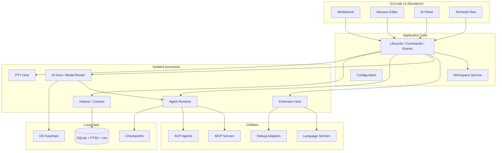

### H.2 Layer rules

- `ui` → application APIs only.
- `core` does not import `ui` or vendor AI SDKs.
- Providers live in `packages/ai/providers/*`.
- Extensions never see secrets or the renderer DOM.
- Agents never see raw filesystem except through tools.

### H.3 Event bus

Typed events, at least:

`workspace.changed`, `file.changed`, `editor.active`, `git.changed`, `diagnostic.updated`, `terminal.started|exited`, `test.started|passed|failed`, `agent.started|paused|completed|failed|blocked`, `tool.started|completed`, `mcp.connected|failed`, `index.progress`, `security.warning`.

Subscribers: UI, indexer (incremental), AI context snapshots, SCM badge, notifications.

### H.4 Interfaces (Phase 0 freeze)

These TypeScript names are the contract. Implementation comes after approval.

```text
ShellHost
WorkspaceService
FileService
EditorService
CommandRegistry
EventBus
ConfigurationService
LanguageClientManager          // LSP
DebugSessionManager            // DAP
TerminalService
GitService
IndexService
ContextEngine
VectorStore
EmbeddingProvider
ModelProvider
ModelRouter
AgentRuntime
AgentOrchestrator
ToolRegistry
Tool
PatchEngine
CheckpointStore
PermissionBroker
SecretVault
McpHost
AcpHost
ExtensionRuntime
TaskGraphStore
AuditLog
```

---

## I. Technology Decision Matrix

Scoring: 1 poor – 5 excellent for *this product*. **Bold = chosen.**

### I.1 Desktop shell

| Criterion | Electron | Tauri 2 | Native GPU | Theia |
| --------- | -------- | ------- | ---------- | ----- |
| Cross-platform identity | 5 | 3 | 2 | 4 |
| Monaco / xterm fidelity | 5 | 3 | 1 | 5 |
| PTY / native modules | 5 | 3 | 4 | 4 |
| RAM / installer | 2 | 5 | 5 | 2 |
| Time to MVP | 5 | 3 | 1 | 3 |
| Security defaults | 3 | 5 | 4 | 3 |
| **Choice** | **Yes (ADR-0002)** | Later | No | No |

### I.2 Editor

| | Monaco | CodeMirror 6 | Custom |
| --- | --- | --- | --- |
| IDE features | 5 | 3 | 1 |
| Inline diff / merge | 5 | 2 | 1 |
| Weight | 2 | 5 | 3 |
| **Choice** | **Yes** | No | No |

### I.3 Frontend

| | React 19 | Solid | Svelte |
| --- | --- | --- | --- |
| Ecosystem / hiring | 5 | 3 | 3 |
| Perf if disciplined | 4 | 5 | 4 |
| **Choice** | **Yes** | No | No |

### I.4 Backend

| | TS only | TS + Go | TS + Rust | Theia Java backend |
| --- | --- | --- | --- | --- |
| UI+core velocity | 5 | 4 | 3 | 2 |
| Indexer/agent daemons | 2 | 5 | 5 | 3 |
| Remote agent binary | 2 | 5 | 5 | 3 |
| **Choice** | MVP fallback | **Yes** | Later hotspots | No |

### I.5 Database / vectors / parser / AI / search

| Concern | Choice | Rejected |
| ------- | ------ | -------- |
| OLTP | SQLite WAL | DuckDB, hosted Postgres on laptop |
| Lexical | FTS5 | ripgrep-only (still used for live grep) |
| Vectors | sqlite-vec via `VectorStore` | Hard-coded Qdrant |
| Parser | Tree-sitter | TextMate-only |
| Intelligence | LSP | In-process compilers for all langs |
| Debug | DAP | Per-language UI |
| Terminal | xterm.js + node-pty | DOM `<pre>` |
| AI | Provider interfaces; Arena AI + OpenAI + Anthropic + Gemini + Ollama | Single vendor |
| Monorepo | pnpm + turbo | Bazel now |
| License | Apache-2.0 proposed | MIT/EPL/BSL |

---

## J. Repository Structure

Monorepo (target). **Not created in Phase 0** except `docs/` and this outline.

```text
g1code/
├── apps/
│   ├── desktop/                 # Electron shell
│   ├── web/                     # Future: same workbench, remote backend
│   └── cli/                     # g1 CLI (index, agent headless)
├── packages/
│   ├── protocol/                # JSON-RPC contracts shared with Go
│   ├── core/                    # application, workspace, config, lifecycle, events
│   ├── editor/                  # monaco wrapper, tabs, groups, diff, commands
│   ├── language/                # lsp, dap client, treesitter, diagnostics, languages
│   ├── terminal/                # shell, sessions, parser, execution
│   ├── git/                     # repository, branches, diff, merge, history
│   ├── ai/                      # providers, models, router, prompts, streaming, safety
│   ├── agents/                  # orchestrator, planner, coder, reviewer, tester, debugger, researcher, docs
│   ├── context/                 # indexer, embeddings, retrieval, rerank, symbols, ast, graph
│   ├── mcp/                     # client, registry, permissions, tools
│   ├── acp/                     # ACP host
│   ├── extensions/              # runtime, api, compatibility, marketplace, sandbox
│   ├── debugger/                # dap, breakpoints, variables, sessions
│   ├── testing/                 # runners, discovery, results, coverage
│   ├── security/                # permissions, secrets, sandbox, audit
│   ├── storage/                 # sqlite, cache, vectors
│   ├── patch/                   # patch engine, checkpoints
│   └── ui/                      # shell, activity-bar, sidebar, panels, ai, explorer, scm, settings
├── extensions/                  # first-party: git extras, docker, k8s, go, java, python, typescript
├── services/                    # Go: agent-service, indexing-service, model-service, mcp-service, update-service
├── tools/                       # build, packaging, testing, development
├── docs/                        # architecture, ai, agents, extensions, security, api, development
├── tests/                       # unit, integration, e2e, performance, security, agent
├── .g1code/                     # product dogfood: agents, prompts, workflows, configuration
├── package.json
├── pnpm-workspace.yaml
├── turbo.json
├── tsconfig.json
├── README.md
└── LICENSE                      # after ADR-0014 confirmation
```

Dependency rule: arrows point downward. `ui` → `core` → `storage`. `agents` → `ai` + `context` + `patch`. No `core` → `agents`.

---

## K. UI Architecture

### K.1 Workbench layout

```text
+-----------------------------------------------------------+
| G1Code | Search | Command | AI | Workspace | Account     |
+------+--------------------------------------+-------------+
|      |                                      |             |
| ACT  |              EDITOR                  | AI          |
| BAR  |                                      | PANEL       |
|      |                                      |             |
+------+--------------------------------------+-------------+
|              TERMINAL / PROBLEMS / OUTPUT / DEBUG         |
+-----------------------------------------------------------+
| Git | Branch | Errors | Warnings | Language | AI Status  |
+-----------------------------------------------------------+
```

Activity bar: Explorer, Search, Source Control, Run/Debug, Extensions, **G1 AI**, **Agents**, **MCP**, Testing.

AI panel tabs: Chat, Agent, Composer, Review, Debug, Terminal, Research, Tasks.

### K.2 Command palette

Everything is a command. Prefix `G1:` for AI/agent:

`G1: Ask AI`, `Start Agent`, `Review Changes`, `Explain Error`, `Fix Error`, `Generate Tests`, `Refactor`, `Run Tests`, `Index Workspace`, `Explain Repository`, `Create MCP Server`.

### K.3 Design system

`@g1code/ui`: tokens, density, focus rings, reduced motion, high contrast. Keyboard first. Screen-reader names on agent status.

### K.4 Profiles

Keymap profiles: G1Code (default), VS Code, Eclipse, Vim, Emacs.

### K.5 Notifications

Agent started / needs approval / modified files / tests failed or passed / completed / blocked / security warning. Non-modal except for destructive permission prompts.

### K.6 AI response UX

Forbidden: unformatted walls of text as the only output.

Required shape:

```text
Summary
Changes   (+ files)
Tests     (pass/fail)
Warnings
[View Diff] [View Tests] [Ask Follow-up]
```

---

## L. Editor Architecture

`EditorService` owns groups, tabs (pinned, preview), split, breadcrumbs, sticky scroll, minimap, folding, multi-cursor, bracket match, inline diagnostics, ghost-text, inline diffs.

**Inline AI (Cmd/Ctrl+K):** selection → prompt → patch → inline diff → Accept / Reject / Accept partial.

Actions: Generate, Explain, Refactor, Fix, Optimize, Document, Test, Translate, Convert.

**Diff / merge:** Monaco diff; 3-way merge for Git.

**Notebooks:** cell model on Monaco; agent can patch cells.

**Large-file mode:** >N MB disables minimap, folding, heavy decorations; streaming I/O.

**Headless path:** AgentRuntime applies patches without opening Monaco.

---

## M. Language Architecture

### M.1 LSP

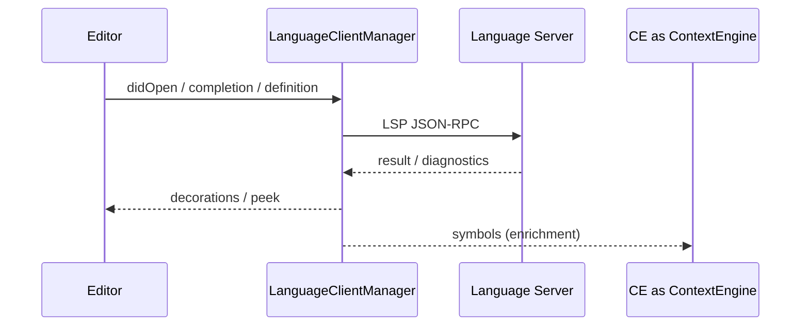

G1Code is an LSP client: completion, diagnostics, definition, references, rename, format, code actions, semantic tokens, document/workspace symbols, hover, signature help, code lens.

### M.2 Tree-sitter

Used for highlight fallback, folds, sticky breadcrumbs, indexer, AST search. Incremental. Grammars are data, not core code.

### M.3 Language tiers

**Tier 1:** Go, Java, JavaScript, TypeScript, Python, C, C++, Rust.  
**Tier 2:** Kotlin, Swift, C#, PHP, Ruby, SQL, Shell, YAML, JSON, XML, Markdown.

Adding a language = grammar pack + LSP adapter + (optional) DAP + test runner plugin. No editor core change.

### M.4 Java / Go depth

Java: Eclipse JDT LS + project importer (Maven/Gradle) as a first-party extension — goal is Eclipse-like navigation, not SWT.  
Go: `gopls` + native test/build integration (Tier 1 flagship).

---

## N. Git Architecture

Native `@g1code/git` wrapping libgit2 or git CLI (decision at implement time: **git CLI first** for correctness of rebase/hooks, libgit2 later for status perf — **unresolved, see AE**).

Porcelain: clone, init, commit, push, pull, fetch, branch, merge, rebase, cherry-pick, stash, tags, blame, log, diff, conflict resolution (merge editor).

AI Git: explain commit, generate message, review changes, risky-change finder, conflict explanation, PR description.

Never `git push --force` without Approval required. Never commit secrets (pre-commit scan in Git service).

---

## O. Terminal Architecture

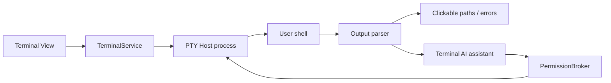

Features: multi-tab, split, shell detection, env detection, history, search, clickable paths/errors.

**AI terminal:** on failed `go test ./...`, offer Explain / Fix automatically / Open failures.

**Command classes:**

- Safe: `ls`, `cat`, `grep`, `git status` — auto if policy allows.
- Approval: `rm`, `git push`, package installs, docker, deploy.

Agents get a **PTY tool**, not a raw `child_process` in the renderer.

---

## P. Debugger Architecture

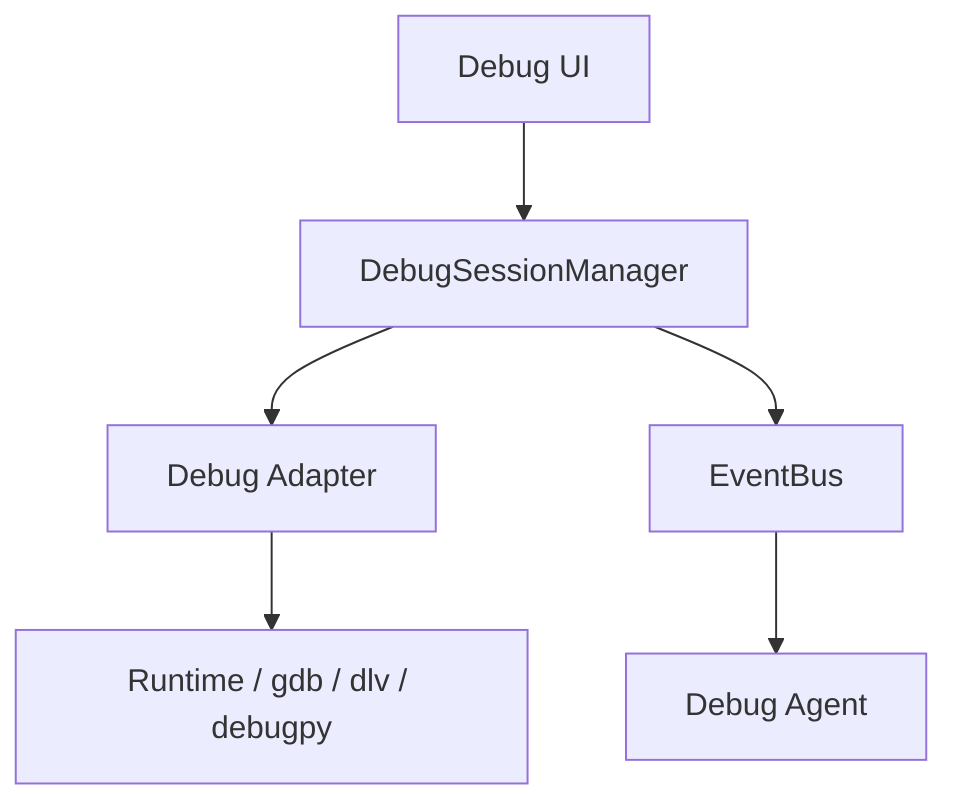

DAP: breakpoints, conditional, logpoints, watch, call stack, variables, threads, exceptions, step over/into/out, continue, restart.

AI debugger: “why is this null?”, “why blocked?”, “explain this stack.” Uses frames + source + recent traces as context, **Ask-mode by default** (no process mutation without permission).

---

## Q. AI Architecture

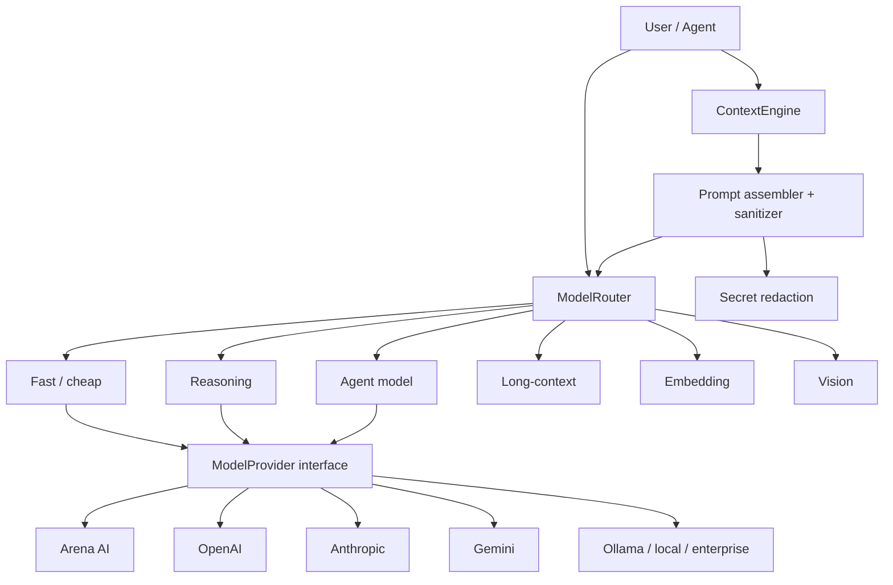

**Routing examples:**

| Job | Model slot |
| --- | ---------- |
| Autocomplete | Fast |
| Explain code | Default / reasoning |
| Large refactor | Reasoning |
| Architecture of repo | Long-context reasoning |
| Autonomous coding | Agent |
| Terminal one-liner | Fast |

User-configurable slots: Default, Fast, Reasoning, Agent, Embedding, Vision.

Streaming is mandatory. Cancellation aborts the HTTP/stdio stream.

**Safety:** prompt sanitizer, output filter for leaking secrets, tool-call schema validation, no provider SDK outside `@g1code/ai`.

---

## R. Agent Architecture

### R.1 Orchestrator

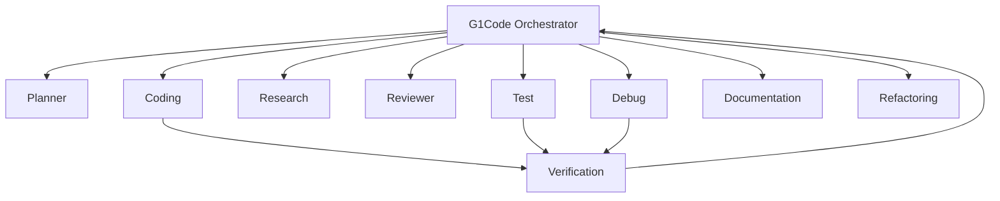

### R.2 Agent loop

```text
Prompt → Context → Plan → Tool select → Execute → Observe
       → Reason → Action → Verify → (loop) → Report
```

The coding agent **does not complete** until verification has run or the user cancelled / skipped with an explicit override.

### R.3 Task graph

Every node:

`id, parent, status, priority, dependencies, inputs, outputs, tools_used, files_changed, errors, logs, duration, agent`

Persisted in SQLite. Resumable. Visible in Tasks UI.

Example:

```text
Task
 ├── Understand repository
 ├── Find authentication implementation
 ├── Analyze current API
 ├── Modify backend
 │    ├── Update controller
 │    ├── Update service
 │    └── Update model
 ├── Modify frontend
 ├── Update tests
 ├── Run tests
 ├── Fix failures
 └── Generate final report
```

### R.4 AgentRuntime

Owns tool execution, timeouts, cancellation propagation (model, tool, terminal, indexer, sub-agent), retries, and **audit events**:

```json
{
  "agent": "coding-agent",
  "tool": "terminal.execute",
  "command": "go test ./...",
  "status": "failed",
  "duration": 2.41
}
```

### R.5 Tool registry

```text
Tool { name, description, schema, permissions, execute(), cancel(), audit() }
```

Built-in: `filesystem.read|write|search|patch`, `terminal.execute|read`, `git.status|diff|commit`, `editor.open|select`, `language.definition|references|symbols`, `test.run`, `debug.start`, `browser.search|open` (future), `mcp.call`.

### R.6 Composer

Visible task, file checklist, plan checklist, Run / Pause / Cancel. Same runtime as Agent, different UX (scoped files).

### R.7 Background agents

Run in Agent Runtime process, optional **git worktree** isolation, notifications on need-approval / done. User keeps editing main worktree.

### R.8 Observability

Timeline (time-stamped steps). Inspect full trace. Cost/tokens per task.

### R.9 Memory

- Session — current thread  
- Workspace — `.g1code/` + DB (architecture notes, conventions)  
- User — preferences (“prefers Go table-driven tests”)  

User can inspect/delete all three. Memory is not a secret store.

---

## S. Context Architecture

### S.1 Engine

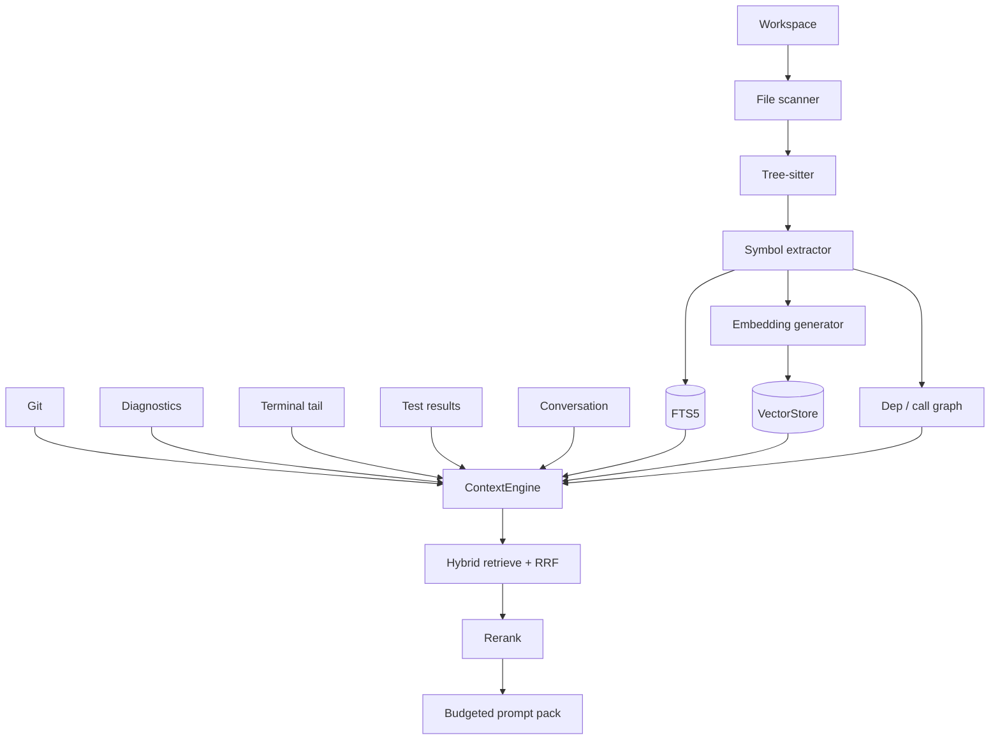

Context sources: files, symbols, AST, imports, dependencies, Git, tests, docs, diagnostics, terminal, user conversation.

**Not** “dump the repo.” Selection policies:

- symbol-aware retrieval  
- semantic search  
- lexical (FTS + ripgrep)  
- AST query  
- dependency/call graph walk  
- Git-aware (touched files, blame)  
- recency (open editors)  
- diagnostics / failing tests  
- terminal last-N  

### S.2 Indexer

Incremental. Content-hash / merkle of files. Do not re-index the repo on every keystroke. Debounce on `file.changed`. Respect `.gitignore` + `.g1codeignore`.

Index: functions, classes, methods, variables, interfaces, packages, modules, imports, deps, comments, docs, tests.

### S.3 Explain Repository / Codebase Map

Agent produces architecture tree, entry points, data flow, risks, test strategy. Graph UI: nodes open files.

### S.4 Search

Unified: filename, text, regex, symbol, AST, semantic, Git, AI.  
Query “find where user authentication is implemented” returns a ranked list of files, not a paragraph.

---

## T. MCP Architecture

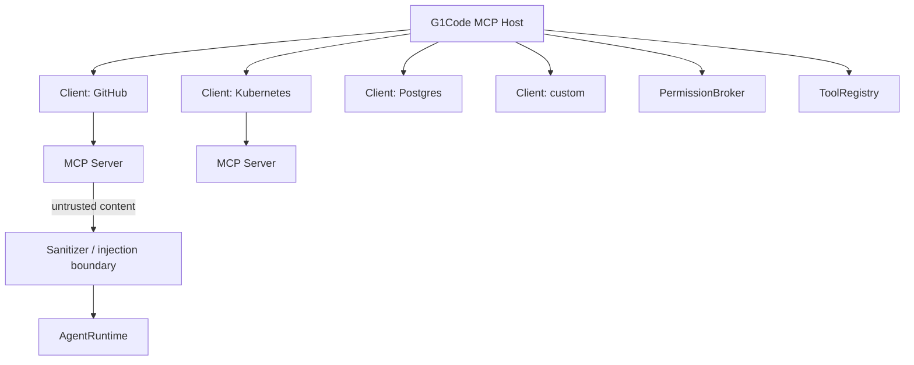

UI: list servers, enable/disable, Add MCP Server, permission badges.

Transports: stdio (local), streamable HTTP (remote).

Building blocks: tools, resources, prompts.

**Security (non-optional):**

- Servers untrusted by default.
- Tool descriptors and results are **data**, not instructions (prompt boundary).
- No automatic write of `.g1code/mcp.json` from model output (the Cursor RCE class).
- OAuth/tokens in SecretVault.
- Lethal trifecta warning when a session has private data + untrusted content + outbound channel.

---

## U. Extension Architecture

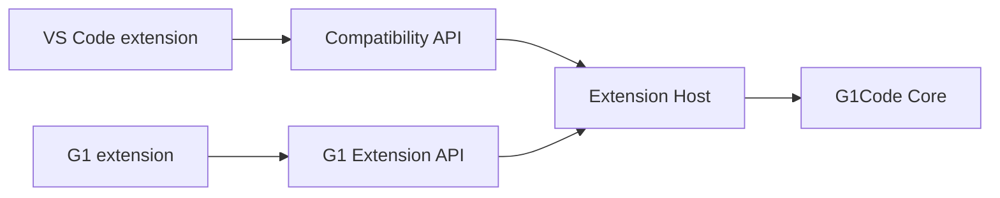

APIs (versioned, TS defs, permissions): UI, Backend, Editor, Terminal, Git, AI, Agent, Context, Workspace, Debugger, Language, MCP, Settings.

Compatibility tracking: Full / Partial / Unsupported / Requires Adapter.

Lifecycle: install, uninstall, enable, disable, update. Sandbox: separate process, no renderer DOM, CSP webviews for custom UI.

Marketplace: see ADR-0015. Private registry in enterprise.

**Avoid VS Code’s trap:** native UI contributions (declared panels, tree views, editors) rather than “hope the extension hacks the DOM.”

---

## V. Security Architecture

### V.1 Threat model

Prompt injection, malicious repo (`.g1code` workflows, hooks), malicious MCP, malicious extension, command injection, credential leakage, exfiltration, agent overreach, supply chain (marketplace).

### V.2 Boundaries

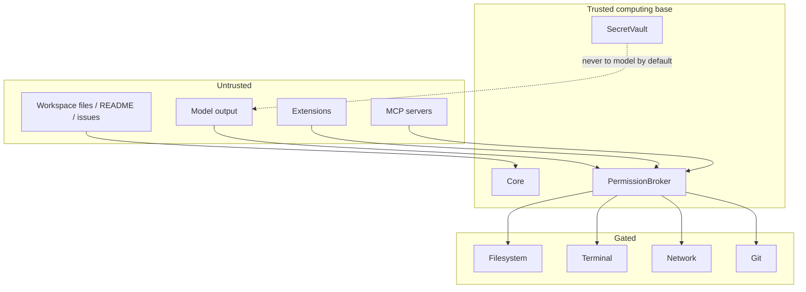

### V.3 Permission levels

`Ask Every Time` · `Ask For Dangerous Actions` · `Auto Approve Safe Actions` · `Full Autonomous` (still patches + audit; still no secret exfil).

Domains: Filesystem, Terminal, Network, Git, MCP, Secrets, Browser, Deployment.

Each tool: `read | write | execute | network | destructive`.

### V.4 Secrets

Never send API keys, tokens, passwords, SSH keys, cloud creds to the model unless the user explicitly attaches them. Redact in prompts, logs, traces. OS keychain.

### V.5 Prompt injection controls

- Separate system policy from retrieved content (tagged untrusted).
- Disallow tool calls that originate solely from retrieved untrusted text without user-visible confirmation when they are network/write/exec.
- No silent MCP config mutation.
- Agent evaluation includes malicious README fixtures.

---

## W. Storage Architecture

| Store | Contents |
| ----- | -------- |
| User DB | settings, UI state, user memory, global MCP, keybindings |
| Workspace DB | tasks, agent history, conversations, embeddings metadata, permissions, tool exec, diagnostics cache, context cache |
| Vector tables | chunk embeddings |
| FTS5 | symbol/doc text |
| Checkpoints | snapshots / worktrees |
| Keychain | secrets |

WAL, migrations, backup of workspace DB on crash. `.g1code/index/` gitignored.

**Do not store secrets in plaintext.**

---

## X. Remote Development Architecture

Designed now, implemented Phase 8.

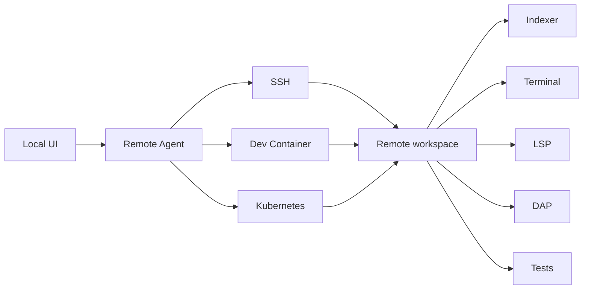

UI stays local. Indexing, compile, test, terminal, debug run next to the code. Workspace DB lives remote. File streaming and patch apply remote.

WSL, SSH, containers, Kubernetes, cloud workspaces share `RemoteHost` interface.

---

## Y. Enterprise Architecture

Designed now; much of it ships Phase 8.

- SSO (OIDC/SAML), RBAC
- Audit log export (agents, tools, MCP)
- Private model endpoints
- Private MCP / extension registries
- Organization policies (permission ceilings, allowed models, data residency)
- Telemetry off by default in Enterprise
- Self-hosted update server
- Air-gap: Local Only privacy mode + local models

Privacy modes: **Local Only** · **Private Cloud** · **Enterprise** · **Standard**. Status bar always shows where source may be sent.

---

## Z. Testing Strategy

| Layer | What |
| ----- | ---- |
| Unit | patch, router, permissions, retrieval scoring, task graph |
| Integration | LSP fake server, git in temp repo, SQLite migrations |
| E2E | open repo, edit, terminal, command palette (Playwright against workbench) |
| Performance | 100k-file fixture, large-file open, index incremental |
| Security | malicious MCP, prompt injection README, secret redaction |
| Agent eval | deterministic benchmark repos (section below) |
| Extension compat | golden list of extensions classified and tested |

### Z.1 AI evaluation framework

Tasks: fix bug, implement feature, refactor, generate tests, explain repo, fix build, fix CI, merge conflict, optimize, find vuln.

Metrics: success, compile, tests pass, regressions, files changed, tokens, time, tool calls, human interventions.

CI uses a **fixture ModelProvider** (recorded). Nightly may hit live Arena AI / one frontier model if keys exist.

---

## AA. Performance Strategy

- Process isolation (ADR-0012).
- Incremental index; never full reindex on save.
- Virtualized UI lists.
- Monaco large-file mode.
- Embeddings batched off-UI; pause when user is typing if CPU contended.
- Cache: git status debounce, LSP document sync, context packs.
- Cancellation everywhere.
- Streaming model output.
- Budget: cold start target **&lt; 3 s** to workbench on reference hardware; typing latency **&lt; 30 ms** p95; index a 50k-file repo without UI freeze.

Honest constraint: Electron will not beat Zed on RAM. We optimize *jank and agent isolation*, not fantasy 50 MB idle.

---

## AB. Deployment Strategy

### Cross-platform

macOS (Apple Silicon + Intel if feasible), Windows x64/ARM64, Linux x64/ARM64.

### Packaging

Electron Builder. Signed binaries (Apple notarization, Windows Authenticode). Linux: AppImage + .deb (rpm later).

### Auto-update

Check → download → **verify signature** → install → rollback. Never execute unsigned updates.

### Crash recovery

Restore files, tabs, terminals, agent tasks, workspace layout.

### Web / cloud

`apps/web` is a future renderer against a remote `Application Core`. Not MVP.

---

## AC. Roadmap

Do not build everything at once.

| Phase | Name | Outcome |
| ----- | ---- | ------- |
| **0** | Architecture | This document, ADRs, interfaces. **← we are here** |
| **1** | Shell | Desktop app, workbench, Monaco, explorer, terminal, palette, settings |
| **2** | Developer core | LSP, Git, debugger, search, test runner, extension host skeleton |
| **3** | AI core | providers, chat, Ask/Edit, context engine, embeddings, index |
| **4** | Agents | runtime, planner, coder, tester, reviewer, debugger, orchestrator |
| **5** | MCP | client, registry, permissions, tool execution |
| **6** | Autonomous | background agents, checkpoints, task graph UX, multi-agent, verification |
| **7** | Ecosystem | compatibility layer, marketplace, SDK, docs |
| **8** | Remote / enterprise | SSH, containers, K8s, SSO, policy |

Each phase: Plan → Implement → Build → Test → Review → Document → Commit checkpoint.

---

## AD. MVP Definition

MVP = end of a **thin vertical slice through Phases 1–6**, not “Phase 6 complete.” A new user can:

```text
Launch G1Code
  → Open repository
  → Index project
  → Ask: "Explain this project"
  → "Add authentication"
  → Agent plans
  → User approves
  → Agent patches code
  → Agent runs tests
  → Agent fixes failures
  → Agent reviews
  → User sees diff
  → User commits
```

### AD.1 MVP must include

Desktop app · Monaco · Explorer · Search · Terminal · Git (status/diff/commit/push/branch) · LSP for at least **TS/JS + one of Go or Python** · Debugging for that language · Extension host foundation · AI chat · Inline edit · Project index · Context engine · Arena AI provider **plus** one OpenAI-compatible provider · Agent runtime · Tool execution (fs patch, terminal, git) · MCP (at least stdio servers) · Diff/patch · Test execution (one runner) · Permissions · Checkpoints.

### AD.2 Explicitly not MVP

Full VS Code extension compatibility, marketplace storefront, SSH/devcontainers, browser agent, SQL IDE, Jupyter completeness, Java Eclipse-parity, multi-agent swarm UX polish, ACP catalog of 60 agents, enterprise SSO.

### AD.3 MVP languages

Ship Tree-sitter + LSP for TypeScript/JavaScript and **Go** (product flagship) or Python if `gopls` friction; the architecture must not hard-code either.

---

## AE. Future Features

- Browser / web agent (Antigravity-class) with permissioned Chrome
- Database explorer + AI SQL
- Notebooks as first-class data science
- Real-time collaboration (not Microsoft Live Share)
- Cloud workspaces
- Graphical codebase map
- CI: GitHub Actions / GitLab / Jenkins / Azure DevOps explain-and-fix
- JetBrains keymap + import
- Eclipse preference importer
- Mobile review of agent diffs (out of scope until desktop is loved)
- Tauri shell adapter if Electron cost dominates

---

## Architecture diagrams (index)

The twelve required diagrams appear above:

1. Overall — §H.1  
2. AI — §Q  
3. Agent — §R.1  
4. Context engine — §S.1  
5. MCP — §T  
6. Extension system — §U  
7. LSP — §M.1  
8. Debugger — §P  
9. Terminal — §O  
10. Workspace — §X (remote) and §Workspace below  
11. Remote development — §X  
12. Security boundaries — §V.2  

### Workspace metadata

```text
.g1code/
├── settings.json
├── agents/
├── prompts/
├── context/
├── tasks/
├── workflows/
├── mcp/
└── index/          # gitignored
```

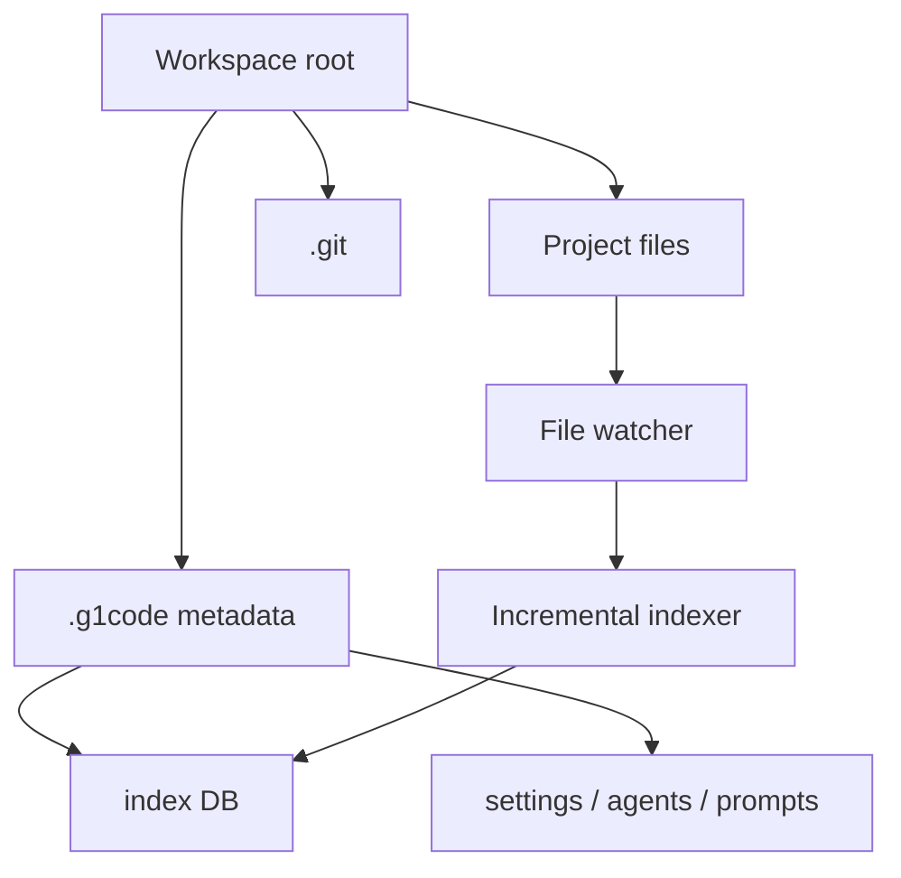

---

## Risks

| Risk | Mitigation |
| ---- | ---------- |
| Rebuilding a workbench takes years | Phased MVP; Monaco; steal UX not code; resist Theia/fork temptation mid-flight |
| Electron RAM vs Zed marketing | Isolate processes; don’t ship 10 renderers; honest positioning |
| VS Code extension users will not switch | Importers + compatibility layer + native LSP for Tier 1 so daily languages work without `ms-*` |
| Prompt injection + MCP RCE class | Untrusted servers, no model-written MCP config, permission broker, eval fixtures |
| Model vendor outage / pricing | Router + local fallback |
| Indexer wrong on huge monorepos | Incremental, ignore rules, cap, language-tier parsing |
| Scope explosion | This outline; phase gates; “not MVP” list |
| Legal: copying VS Code | No vscode source; MIT components only; Open VSX not MS marketplace |
| Two-language (TS+Go) drag | Interfaces first; TS fallback for services in early phases |
| Agent destroys user work | Patches, checkpoints, worktrees, ask-for-dangerous |

---

## Unresolved decisions

These are **open** on purpose. Do not silently resolve them in code.

1. **git CLI vs libgit2** for status performance.  
2. **Tree-sitter native vs WASM** per OS.  
3. **Default embedding model** (local vs API) for Standard vs Local Only.  
4. **Whether Phase 1 services are TS stubs or Go from day one** (interfaces frozen either way).  
5. **ADR-0014 license** (Apache-2.0 proposed).  
6. **Exact compatibility target list** for VS Code extensions in Phase 7.  
7. **Worktree vs snapshot-dir** for checkpoints on Windows.  
8. **Whether `apps/web` shares Electron’s renderer bundle** in Phase 8.  
9. **Default Agent permission level** for new users (recommendation: Ask For Dangerous Actions).  
10. **Brand design system** (visual identity) — product, not architecture.

---

## Phase 0 stop line

**Do not implement the IDE until this outline is reviewed.**

After approval, Phase 1 starts with `ShellHost` + workbench skeleton only, following the loop:

```text
Plan → Implement → Build → Test → Review → Document → Commit checkpoint
```

End state of the program:

> **G1Code — an AI-native IDE where the AI doesn’t just help you write code; it understands, builds, tests, debugs, reviews, and evolves the entire software project with you.**
